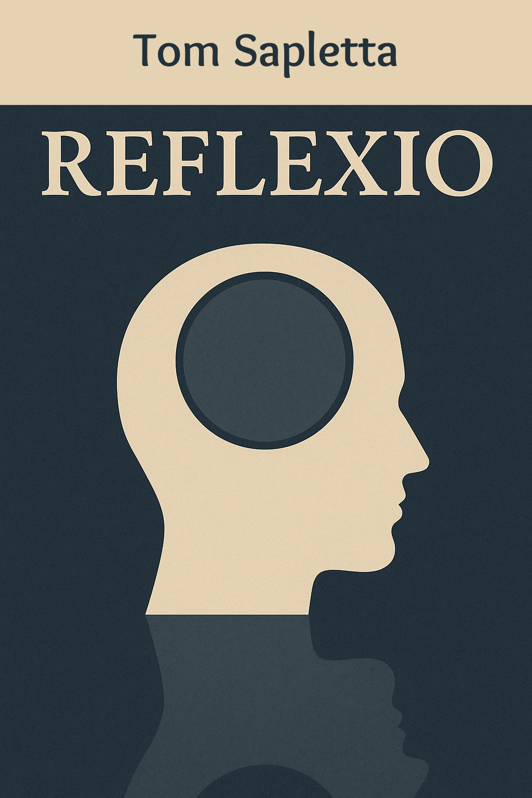

+ [/home/tom/github/tom-sapletta-com/Reflexio](file:///home/tom/github/tom-sapletta-com/Reflexio/)
+ [1 ](file:///home/tom/github/tom-sapletta-com/Reflexio/1/index.html)
+ [md2pdf <style>](file:///home/tom/github/tom-sapletta-com/Reflexio/md2pdf/index.html)
+ [1 ### Rozdział 1: Projekt](file:///home/tom/github/tom-sapletta-com/Reflexio/1/index.html)
+ [1 ### Rozdział 2: Krakowianie i przybysze](file:///home/tom/github/tom-sapletta-com/Reflexio/1/index.html)
+ [1 ### Rozdział 3: Przeszłość w teraźniejszości](file:///home/tom/github/tom-sapletta-com/Reflexio/1/index.html)
+ [2 ## Reflexio, CZĘŚĆ II: KORZENIE (Retrospekcje)](file:///home/tom/github/tom-sapletta-com/Reflexio/2/index.html)
+ [2 ### Rozdział 4: Dzieciństwo w cieniu historii](file:///home/tom/github/tom-sapletta-com/Reflexio/2/index.html)
+ [2 ### Rozdział 5: Rok 1989](file:///home/tom/github/tom-sapletta-com/Reflexio/2/index.html)
+ [2 ### Rozdział 6: Dojrzewanie w nowym świecie](file:///home/tom/github/tom-sapletta-com/Reflexio/2/index.html)
+ [3 ## Reflexio, CZĘŚĆ III: RELACJE (2025)](file:///home/tom/github/tom-sapletta-com/Reflexio/3/index.html)
+ [3 ### Rozdział 7: Perspektywy](file:///home/tom/github/tom-sapletta-com/Reflexio/3/index.html)
+ [3 ### Rozdział 8: Konfrontacje](file:///home/tom/github/tom-sapletta-com/Reflexio/3/index.html)
+ [3 ### Rozdział 9: Kryzysy](file:///home/tom/github/tom-sapletta-com/Reflexio/3/index.html)
+ [4 ## Reflexio, CZĘŚĆ IV: PRZEMIANY WEWNĘTRZNE (2025)](file:///home/tom/github/tom-sapletta-com/Reflexio/4/index.html)
+ [4 # Reflexio](file:///home/tom/github/tom-sapletta-com/Reflexio/4/index.html)
+ [4 ### Rozdział 11: Pojednania](file:///home/tom/github/tom-sapletta-com/Reflexio/4/index.html)
+ [5 ## Reflexio, CZĘŚĆ V: EUROPA 2025](file:///home/tom/github/tom-sapletta-com/Reflexio/5/index.html)
+ [5 ### Rozdział 12: Integracja](file:///home/tom/github/tom-sapletta-com/Reflexio/5/index.html)
+ [5 ### Rozdział 13: Nowe kryzysy](file:///home/tom/github/tom-sapletta-com/Reflexio/5/index.html)
+ [5 ### Rozdział 14: Dziedzictwo](file:///home/tom/github/tom-sapletta-com/Reflexio/5/index.html)
+ [5 ### Rozdział 15: Świadectwa](file:///home/tom/github/tom-sapletta-com/Reflexio/5/index.html)
+ [6 ## Reflexio,  Posłowie](file:///home/tom/github/tom-sapletta-com/Reflexio/6/index.html)
+ [6 ](file:///home/tom/github/tom-sapletta-com/Reflexio/6/index.html)
+ [#6 ](file:///home/tom/github/tom-sapletta-com/Reflexio/#6/index.html)
+ [6 # Posłowie - Reflexio](file:///home/tom/github/tom-sapletta-com/Reflexio/6/index.html)
